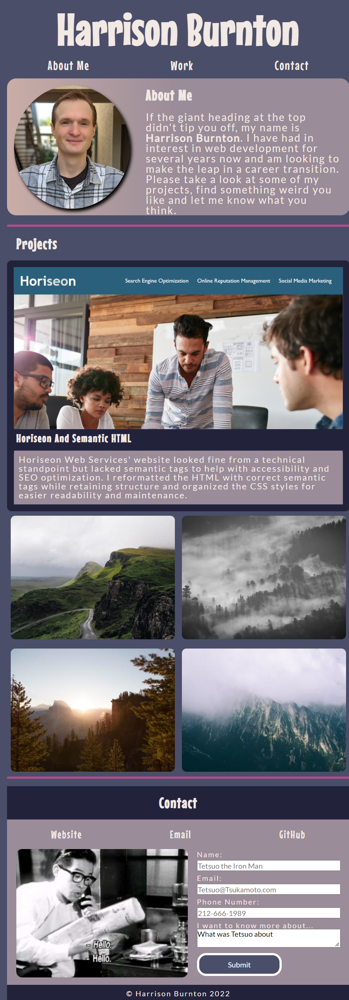

# The Simian Portfolio

## Description

Welcome to the Simian Portfolio. The work-in-progress portfolio for Harrison Burnton!

- Having a portfolio is an important part of having a presence as a web designer so it was important for me to create a portfolio that showcases my work as well as myself.
- This portfolio now exists! I exist online and have some work to show for it. People are able to learn more about me, my work, and ways to contact me or explore more projects of mine. 
- Making this portfolio was a challenge. I learned much about using CSS and Flexbox and how to find solutions to problems by doing something very complicated called "googling". Truly it began to push some of my google-fu abilities to find some of those sticky questions. I learned much about styling and using inspector tools as well to experiment and tweak CSS.

## Deployed Site
[Live site can be viewed here](https://hburnton.github.io/the_simian_portfolio/)

## Credits

Text overlay effect adapted from https://www.w3schools.com/howto/howto_css_image_overlay_title.asp

Reset style sheet adapted from prior classwork assignments

## Badges

I don't really need a badge at this point but look at that!

